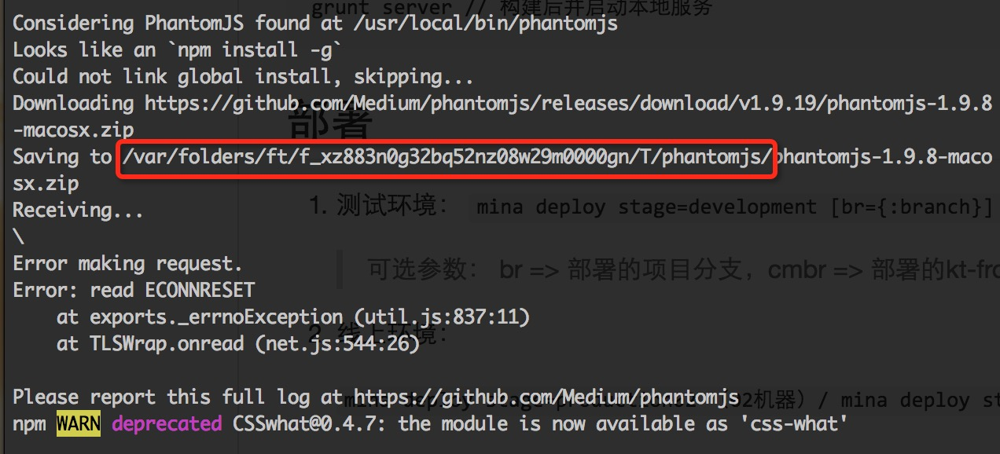

# kt-lode-frontend

> 小贷资产管理交易平台 - 前端项目

## 预装环境
1. [nodejs](https://nodejs.org/en/)(^4.1.0)
2. [npm](https://www.npmjs.com/)(^2.14.0) 安装：一般随nodejs一起安装
3. [bower](http://bower.io/)(^1.7.0) 安装：npm install -g bower
4. [grunt-cli](http://gruntjs.com/)  安装：npm install -g grunt-cli
5. graphicsmagick(or imagemagick) 安装：brew install graphicsmagick(or sudo yum install imagemagick)

## 项目初始化
    npm run setup // 如果同级目录没有通用库，则下载kt-frontend-common并组装，同时下载依赖的node_modules, bower_components
        
## 开发
    grunt live // 本地开发模式
## 本地构建
    grunt build(or grunt)
## 本地打包预发预览
    grunt server // 构建后并启动本地服务
## 部署
1. 测试环境：
    `mina deploy stage=development [br={:branch}] [cmbr={:common_branch}]`
    
    > 可选参数： br => 部署的项目分支，cmbr => 部署的kt-frontend-common项目分支，默认都为test分支
2. 线上环境：
    
    `mina deploy stage=production02 （02机器）/
    mina deploy stage=production03 （03机器）`

## 环境搭建问题可能遇到的问题：

1. 如果软链组装出现问题，本项目依赖kt-frontend-common项目，可以手动clone到本地后软链到项目的app/common
1. node_modules问题
    1. 如果遇到，gm & convert命令错误,需要预先安装graphicsmagick 或者 imagemagick  (mac :brew install or centos: sudo yum install imagemagick)
    1. phantomjs安装下载超时，手动浏览器下载后，复制到错误提示所在的目录,例如下图：
    
    
